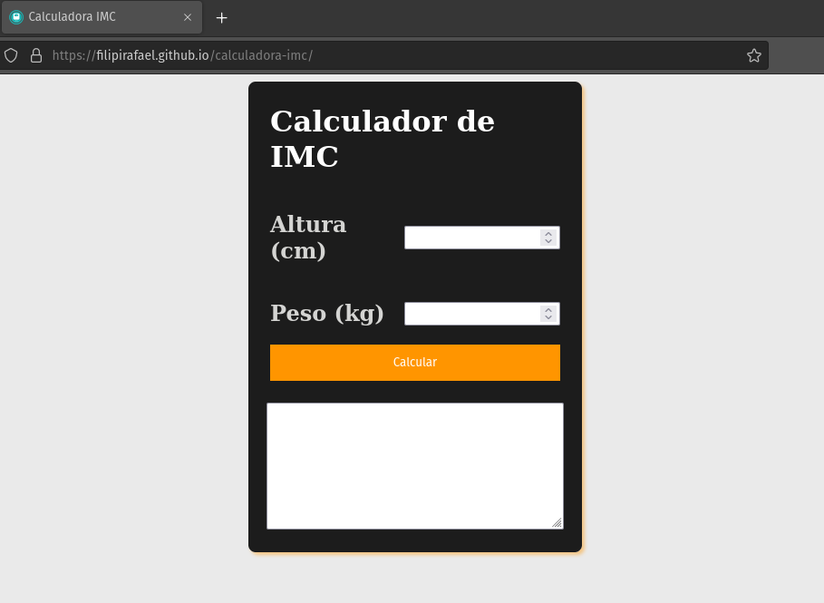

# Calculadora de IMC (IOS Design)

    

## Sobre o Projeto
A ideia do projeto foi para aplicar, práticar e melhorar minhas habilidades técnicas em desenvolvimento web. 

**Acesse no seu navegador clicando aqui**: https://filipirafael.github.io/calculadora-imc/

## Novas versões
Conforme vou adquirindo novas habilidades, irei atualizando o projeto em novas versões. 